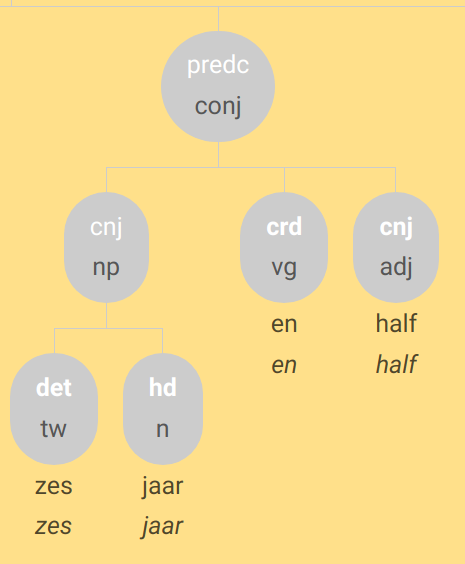
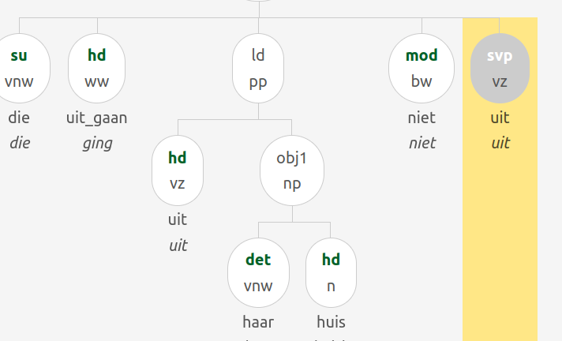

# Zoeken naar dialectconstructies in het GCND-corpus met behulp van XPath

Zie voor meer informatie ook:

* [Lassy annotatiehandleiding](https://www.let.rug.nl/~vannoord/Lassy/sa-man_lassy.pdf)
* Voor een algemeen GrETEL tutorial:  [Tutorial van Jan Odijk](https://surfdrive.surf.nl/files/index.php/s/xfjVB2AfwgOpmNM)
* [Documentatie bij de PaQu-zoekapplicatie](https://paqu.let.rug.nl:8068/info.html#re)


## Inleiding

Hoewel de GReTEL-applicatie de mogelijk biedt om met example-based search te zoeken, 
is het in veel gevallen toch noodzakelijk met XPath aan de slag te gaan.

* De example-based search van GrETEL zal voor sommige dialectconstructies niet goed werken 
   omdat Alpino de gebruikersinvoer niet op de gewenste manier analyseert. Zie bijvoorbeeld subjectverdubbeling (1.1)
* In de example-based search kom je niet meteen tot de essentie van wat je zoekt; 
   om een hogere _recall_ te bereiken zal de gegenereerde query moeten worden aangepast. Hieronder een voorbeeld:


We zoeken naar "groter dan/of/als X"-constructies. We voeren "_groter dan een olifant_" in bij de example-based search.

De analyse is:


en de bijbehorende xpath is

```xpath
//node[@cat="ap" and @rel="--" and
    node[@pt="adj" and @rel="hd"] and
    node[@cat="cp" and @rel="obcomp" and
        node[@pt="vg" and @rel="cmp"] and
        node[@cat="np" and @rel="body" and
            node[@pt="lid" and @rel="det"] and
            node[@pt="n" and @rel="hd"]]]]
```

Hiermee worden 2 resultaten gevonden - een beetje mager resultaat. De query is dus 
duidelijk te restrictief. 
Naar `@rel="--"` waren we niet op zoek, en eigenlijk maakt de vorm van het vergelijkende element ook niet uit. 
We moeten de query dus tot zijn essentie reduceren:

```xpath
//node[@cat="ap" and
    node[@pt="adj" and @rel="hd"] and
    node[@cat="cp" and @rel="obcomp" and
        node[@pt="vg" and @rel="cmp"] and
        node[@rel="body" ]]]
```

Hiermee vinden we 118 resultaten, een aannemelijker aantal.

### XPath voor het zoeken in Alpino-structuren


#### Algemeen

De Alpino-analyses zijn gecodeerd in XML. Een knoop in de analyseboom corresponeert met een element `node` in de XML-codering. 
De nesting van `node`-elementen definieert de hierarchische zinsstructuur.

##### Zoeken op eigenschappen van `node`

De xpath-query ```//node``` zoekt naar nodes onafhankelijk van de diepte in de hierarchisch structuur. 
Om nodes op grond van hun eigenschappen te selecteren gebruiken we de attributen van het element.

XML:
```xml
<node word='olifant'/>
```
XPath:
```xpath
//node[@word='olifant']
```

Met `[]` wordt een conditie aan het voorgaande `node`-element opgelegd; attributen
worden in de query aangeduid met `@attribuut_naam`.
Alle knopen hebben een attribuut `@rel` dat de dependentierelatie aanduidt, en `@begin` en `@end` waarmee respectievelijk 
de begin- en eindpositie (in woorden, met 0 voor het eerste woord in de zin) van een woord of zinsdeel worden aangegeven.


| dependentielabel | omschrijving
|---|---
| APP | appositie, bijstelling
| BODY | romp (bij complementizer))
| CMP | complementizer
| CNJ | lid van nevenschikking
| CRD | nevenschikker (als hoofd van conjunctie)
| DET | determinator
| DLINK | discourse-link
| DP | discourse-part
| HD | hoofd
| HDF | afsluitend element van circumpositie
| LD | locatief of directioneel complement
| ME | maat (duur, gewicht, . . . ) complement
| MOD | bijwoordelijke bepaling
| MWP | deel van een multi-word-unit
| NUCL | kernzin
| OBCOMP | vergelijkingscomplement
| OBJ1 | direct object, lijdend voorwerp
| OBJ2 | secundair object (meewerkend, belanghebbend, ondervindend)
| PC | voorzetselvoorwerp
| POBJ1 | voorlopig direct object
| PREDC | predicatief complement
| PREDM | bepaling van gesteldheid ‘tijdens de handeling’
| RHD | hoofd van een relatieve zin
| SAT | satelliet; aan- of uitloop
| SE | verplicht reflexief object
| SU | subject, onderwerp
| SUP | voorlopig subject
| SVP | scheidbaar deel van werkwoord
| TAG | aanhangsel, tussenvoegsel
| VC | verbaal complement
| WHD | hoofd van een vraagzin

Simpele zoekvragen met deze attributen: ()

| gezocht | XPath
|--|--
| Object aan het begin van de zin | ```ixpath //node[@rel='obj1' and @begin='0']```

De "bladeren" in de knoop (de woorden) zijn voorzien van (onder andere) de volgende attributen:

| attribuut | omschrijving
|--|--
|@word | woordvorm (zware vernederlandsing)
|@dialect_word | woordvorm (lichte vernederlandsing)
|@lemma | lemma
|@pt | woordsoort (woordsoort volgens de CGN-tagset)
|@postag | woordsoort volgens CGN, met features
|@wvorm, @buiging, .... | CGN PoS features

Simpele zoekvragen met deze attributen:

| gezocht               | XPath
|-----------------------|--
| Substantiva           | ```ixpath //node[@pt='n']```
| Adjectief als subject | ```ixpath //node[@pt='adj' and @rel='su']```

Niet-bladeren hebben in plaats van de PoS informatie een categorielabel dat het type constituent aangeeft.

| attribuut | omschrijving
|-----------|--
| @cat      | categorielabel


| categorielabel | omschrijving
|----------------|-------------
| AP             | bijvoeglijk-naamwoordgroep
| ADVP           | woordgroep met bijwoord als hoofd
| AHI            | aan het-infinitief-groep
| CONJ           | nevenschikking
| CP             | frase ingeleid door onderschikkend voegwoord
| DETP           | woordgroep met lidwoord als hoofd
| DU             | discourse unit
| INF            | kale infinitiefgroep
| NP             | naamwoordelijke constituent
| OTI            | om te-infinitief-groep
| PPART          | voltooid/passief-deelwoordgroep
| PP             | voorzetselconstituent
| PPRES          | tegenwoordig-deelwoordgroep
| REL            | relatieve zin
| SMAIN          | declaratieve zin (werkwoord op tweede plaats)
| SSUB           | bijzin (V finaal)
| SVAN           | van-zin
| SV1            | werkwoordsinitiële zin (ja/nee-vraag, bevel)
| TI             | te-infinitief-groep
| WHREL          | relatieve zin met ingesloten antecedent
| WHSUB          | constituentvraag: ondergeschikte zin
| WHQ            | constituentvraag: hoofdzin

##### Hierarchie en assen, de "current node"

De basis van een Xpath query wordt gevormd door een pad door de XML-structuurboom. Op zo'n pad kan omlaag, omhoog of opzij gelopen worden. In XML-terminologie noem je de richting van zo'n stap een "as" (axis).

Een stap naar beneden doe je met "/": (zoek een determiner direct binnen een NP)
```xpath
//node[@cat='np']/node[@rel='det']
```

Een willekeurig aantal stappen naar beneden is "//". Determiners willekeurig diep binnen een NP zijn dus

```xpath
//node[@cat='np']//node[@rel='det']
```


Een stap omhoog is "..". De knoop boven een determiner zoek je dus met  

```xpath
//node[@rel='det']/..
```

Naast deze korte aanduidingen zijn er de 'lange' asaanduidingen

* child:: een stap naar beneden. child::node is hetzelfde als ./node
* parent:: een stap omhoog (..)
* descendant:: een willekeurig aantal stappen naar beneden (//)
* ancestor:: een willekeurig aantal stappen omhoog
* following-sibling:: een willekeurig aantal stappen naar rechts
* preceding-sibling:: een willekeurig aantal stappen naar links
* self:: geen stap
* descendant-or-self:: een willekeurig aantal stappen naar beneden, mogelijk 0
* ancestor-or-self:: een willekeurig aantal stappen omhoog, mogelijk 0

De lange notatie moet - behalve voor de stappen waarvoor geen kort equivalent bestaat - worden gebruikt om condities te kunnen opleggen. Niet-NP-parents van een determiner zijn dus bijvoorbeeld:

```xpath
//node[@rel='det']/parent::node[@cat!='np']
```

Om te kunnen volgen wat het resultaat van een query is en waar de condities op werken, moet worden bijgehouden wat na iedere stap de "current node" (aangeduid met ".") is. Iedere stap modificeert de current node, een conditie doet dat niet.

Nodes die direct een determiner bevatten zijn dus

```xpath
//node[./node[@pt='det']]
```

In tegenstelling tot het ophalen van de determiners zelf met

```xpath
//node/node[@pt='det']
```

##### Opletten

* Let op: "bladeren" (woordknopen) hebben geen categorie. Een losstaand zelfstandig naamwoord is dus geen NP, en een ongemodificeerd adjectief is geen AP.
* De volgorde van nodes in de XML is niet altijd dezelfde als de volgorde in de zin. Om positie te vergelijken moeten de attributen `@begin` en `@end` gebruikt worden. 
* Vergeet bij vergelijking van woordposities niet `@begin` en `@end` als getallen op te vatten door `number(@begin)`, etc.
* In de huidige applicatie moeten de labels in lowercase worden ingevoerd
* Let op gecoindexeerde woorden 

Uitleg bij het laatste punt: Bij de query ```//node[@rel='obj1' and @begin='0']``` hierboven vonden 
we onder andere het onjuiste resultaat _**k** zijn ier geboren_. Bij inspectie ziet de boom er zo uit:


De interferentie van de geindexeerde spooknodes kan worden vermeden met bijvoorbeeld

```xpath 
//node[@rel='obj1' and @begin='0'][@word or .//node[@word]]
```


##### Eenvoudig voorbeeld ontleend aan (Tutorial Odijk):

Stel dat we zoeken naar adjectieven met een bijwoordelijke modifier.

* ah ba ja t ... bestaat **al lang** eni .

In de Alpino-boom ziet dat er zo uit:


De XPath-vertaling van deze structuur is

```xpath
//node[@cat="ap" and
     node[@pt="bw" and @rel="mod"] and
     node[@pt="adj" and @rel="hd"]]
```

Stapsgewijze uitleg:

| Xpath                                        | Interpretatie
|----------------------------------------------|-------------
| //                                           | zoek overal in de boom
| node                                         | naar een knoop met tag  node
| [                                            | begin van de condities op node
| @cat = | "cat" attribuut(@) cat heeft waarde `ap` 
| and | en 
| node | bevat een knoop met tag node
| [@pt="bw" and @rel="mod"] | met attribuut pt = `bw` en attribuut rel = `mod`
| and |  en
| node | een knoop met tag node
| [@pt="adj" and @rel="hd"] | met attribuut pt = `adj` en attribuut rel = `hd`
| ] | einde van de condities


In het vervolg kijken we hoe een aantal typische dialectconstructies met behulp van XPath-queries kunnen proberen terug te vinden. 

## 1. Subjectsverschijnselen

### 1.1 subjectverdubbeling (of drievoudig subject)

* _Ik_ heb _ik ik_ dat niet gezegd.
* en t jij ee t jij zijn kazak gekeerd .

```xpath
//node[count(./node[@rel='su']) > 1]
```

### 1.1 subject in objectvorm

* omdat _hem_ peinsde dat dat zijn kindje was.

```xpath
//node[@rel="su" and @word="hem"]
```

Iets algemener:

```xpath
//node[@rel="su" and @naamval="obl"]
```

### 1.3 Presentatief 'het'

Deze constructie wordt noch in de Lassy-handleiding noch in de CGN-beschrijving besproken.
In het GCND is dit _het_ zoals presentatief _er_ behandeld, en heeft _het_ dus het dependentielabel _MOD_.

* en **het** waren er hier een hele rij .

Vindbaar met:

```xpath
//node[@rel='mod' and @word='het']
```

## 2. Uitbreidingen van de zin: TAG en SAT

### Discourse-structuren in de Lassy annotatie

Uit het Lassy-annotatiemanual:

| dependentielabel | OMSCHRIJVING                                                                                                                                                                                            |
|---|---------------------------------------------------------------------------------------------------------------------------------------------------------------------------------------------------------|
| NUCL | kernzin                                                                                                                                                                                                 |
| DLINK | discourse-link In samenhangende tekst komt het vaak voor dat een spreker een zin begint of eindigt met iets dat op een voegwoord lijkt, maar geen syntactisch verband heeft: _maar wat ik zeggen wou ..._ |
| SAT | satelliet: aan- of uitloop ‘aanloop’- en ‘uitloop’-elementen die een anaforische relatie onderhouden met verwijswoorden in de kernzin.  _NUCL:[het verbaast me] SAT:[dat je dat nog weet]_              |
| TAG | aanhangsel, tussenvoegsel. Elementen die op een andere manier dan DLINK en SAT buiten de kernzin staan                                                                                                  |
| DP  | discourse-part                                                                                                                                                                                          |

| categorielabel | OMSCHRIJVING |
|---|---|
| DU  | discourse-unit |


### 2.1 Linker zinsperiferie

#### 2.1.a Aanloopconstructie (Left dislocation)

* _Jan_, die ken ik niet

Dit kan ook via example-based search worden gevonden.

Herkenbaar aan dependentierelatie _SAT_ en (categorie _np_ of woordsoort zelfstandig naamwoord (_n_).

```xpath
//node[@rel='sat' and (@cat='np' or @pt='n')][@begin="0"]
```


##### 2.1.b Hanging Topic / Hangend Topic / Nominativus Pendens:

* _mijn vent_ wist _hij_ ook niet wat dat was en nu komt ...

Er staat steeds een naamwoordgroep in de eerste positie, die later in de zin door een persoonlijk voornaamwoord (hij, het, zij, hem, haar) wordt opgenomen

Nominale tag-nodes aan het begin van de zin zoek je met

```xpath
//node[@rel='tag' and (@cat='np' or @pos='noun') and @begin="0"]
```

Niet alle matches van deze query zijn daadwerkelijk topicalisaties.

#### 2.1.c Tussenwerpsels en aansporingen

* zo, dat was plezant.

* natuurlijk, moeilijk is het niet.

* kom, ik ga er maar vandoor.

* jongens, ik vertrek nu.

Met dit soort structuren kan Alpino doorgaans vlotjes om; preprocessing is dan ook niet nodig.

Geanalyseerd met dependentierelaties tag (voor tussenwerpsel of aansporing) en nucl (voor de eigenlijke zin)
```xpath
//node[@rel='tag' and 
      (@cat="pp" or @pt='bw' or @cat="advp" or @pt="tsw") and @begin="0"]
   [../node[@rel='nucl']]
```

#### 2.1.d Inversieloos V-later-dan-2 / V>2 / Noninverted V3

* zeg als je nu trouwt _het zijn altijd voort kosten_.

```xpath
//node[node[@rel="tag" and @cat="cp"] and node[@rel='nucl' and @cat='smain']]
```


Mogelijk ook:
```xpath
//node[node[@rel="tag" and @cat="pp"] and node[@rel='nucl' and @cat='smain']]
```

* in de zomer _t e klaar tot sn avonds t negenen_


#### 2.1.e Ingebedde dislocaties

* Wat vindt u der eigenlijk van *dat zulke zinnen* dat die zo geanalyseerd worden?

Zijn getagd met met _SAT_.


!NB: het is me niet gelukt ze in het corpus terg te vinden.

<!--
```xpath
//node[@rel='sat' and (@cat='np' or @pt='n')][number(@begin) > 0]
   [following-sibling::node[@rel='nucl' and @cat='ssub']]
```
//node[@rel='sat' and @cat="cp"][../node[@cat="ssub"]]
-->

#### 2.1.f ja/nee het/ik/…

* _Bwa nee_ het jong
* ja _ja ze_ het is heel juist


```xpath
//node[@rel='tag'][node[@rel='mwp' and @pt='tsw'] 
     and node[@rel='mwp' and @pos='pron']]
```


### 2.2 V2-bijzinnen - pseudodirecte rede

* hij zei hij weet het niet
* ik zeg gisterenavond , ik moet de auto binnensteken ut tut tut .
* ik zeg , steek hem binnen .

(Laatste met sv1, verschil met smain niet zo duidelijk?)

* Inleidende matrixzin (hij zei):
  * Dependentielabel (rel): tag
  * Categorielabel (cat): smain

* Pseudodirecte rede - V2-bijzin (hij weet het niet):
    * Depentielabel (rel): nucl
    * Categorielabel (cat): smain (of – bij werkwoordsinitiële zinnen – sv1)


```xpath
//node[
     node[@rel='tag' and @cat='smain'] and 
     node[@rel='nucl' and (@cat='smain' or @cat='sv1')]]
```

### 2.3 Intercalaties/parentheses/interpositio

Let op: afwijking van Lassy: In het GCND kiezen we ervoor parentheses het dependentielabel TAG te geven en op hetzelfde niveau als de hoofdzin onder te brengen .


```xpath
//node[@rel='tag' and @cat='smain']
   [number(../node[@cat='smain' and @rel='nucl' and @begin and @end]
/@begin) < @begin]
   [number(../node[@cat='smain' and @rel='nucl' 
        and @begin and @end]/@end) > @begin]
```

## 3. Complementizer-fenomenen

### 3.1 Afwijkende comparatieve voegwoorden (of, als, gelijk als, gelijk of dat)

* maar het scheelt meer _of de helft_ .
* dat is veel langer _als dat ik ik ben_ .

Voor 'of' bijvoorbeeld:

```xpath
//node[@rel='obcomp'][./node[@rel='cmp' and @word='of']]
```

Meerwoordige voegwoordelijke combinaties:

```xpath
//node[@rel='obcomp'][./node[@rel='cmp' and @cat='mwu']]
```

### 3.2 Directe rede ingeleid door van

* ja die zeggen _van , als we daar in de tranchée en zaten_ ...

Vindbaar met:

```xpath
//node[@rel="vc"  and @cat="svan"]
```

Beperkt tot combinatie met "zeggen"

```xpath
//node[node[@rel="hd" and @lemma="zeggen"] 
   and node[@rel="vc"  and @cat="svan"]]
```

### 3.3 Expletief dat

#### Type 1: na onderschikkend voegwoord

* Ik weet niet of dat hij komt.
* Om het te zeggen gelijk of dat het is: …
* ik was getrouwd sinds dat hij nog bij het leger was

```xpath
//node[@cat='cp']/node[@rel='cmp' and @cat='mwu'][./node[@word="dat"]]
```

#### Type 2: na vraagwoord
* Ik weet niet _wie dat_ er komt.
* we gaan weer moeten de tijd afwachten _wat dat_ er allemaal gaat voorvallen

```xpath
//node[@word="wie" and @rel="whd"]
   [following-sibling::node[./node[@word="dat" and @pt="vg"]]]
```

#### Type 3: na betrekkelijk voornaamwoord

* De mens _die dat_ jou moet helpen, zal vloeken.
* nee ze voor de oorlog veertien achttien was waren er dan nog knechten _die dat_ we winter zomer hadden

```xpath
//node[@word="die" and @rel="rhd"]
   [following-sibling::node[./node[@word="dat" and @pt="vg"]]]
```

#### Type 4: na vraagwoord + of (zeldzaam in Vlaanderen, cf. Lassy-handleiding)

* Zijn er meer mogelijkheden dan _wat of dat_ je nu hebt?

(Niet te vinden in corpus)

```xpath
//node[@cat="whsub" and @rel="body" and
     node[@lemma="wat" and @pt="vnw" and @rel="whd"] and
     node[@cat="cp" and @rel="body" and
         node[@cat="mwu" and @rel="cmp" and
            node[@lemma="of" and @pt="vg" and @rel="mwp"] and
            node[@lemma="dat" and @pt="vg" and @rel="mwp"]]]]
```
<!--

-->

### 3.4 Beknopte bijzinnen ingeleid door _voor_ of _van_ in plaats van _om_

* een restaurant _voor te blijven voor te eten_

```xpath
//node[@cat='oti'][./node[@rel='cmp' and @pt='vz' 
      and (@word='voor' or @word='van')]]
```

### 3.5. Afhankelijke ja/nee-vragen ingeleid door _als_ ipv of

* k weet nie _a je da weet_ .

```xpath
//node [
  node[@rel="vc"]
    [node[@lemma="als"] and
      node[@rel="body"]] and 
  node[@rel="hd" and @pt="ww"]
  ]
```

### 3.6. Bijzin met hoofdzinsvolgorde (V2-bijzin of Nebensätze)

* Die rol heb ik heel graag gespeeld omdat _er zat poëzie in_.
* awaar , da _zij smokkelden patatten_ en ...
* dan viel . et voor da _ge kost ne paling draaien_


```xpath
//node[@cat='cp']
   [node[@rel='cmp' and @pt='vg']]
   [node[@cat='smain']]
```

Deze query heeft een lage precisie (in een aantal gevallen met bijzinvolgorde is smain geannoteerd).


<!--
Hoofdzinvolgorde wordt gekenmerkt door

* object na werkwoordelijk hoofd
* of subject na werkwoordelijk hoofd
* Let op object kan in VC zitten
* Let op _omdat zij wil broodjes eten_ etc zijn weliswaar te duiden als hoofdzinvolgorden, maar ook als WW-clusteronderbrekingen

Object is losstaand znw (dus geen _VC_ node aanwezig in boom):
```xpath
//node[@cat='ssub'][
    node[@rel='hd' and @pt='ww']
      [number(../node[@rel='obj1' and @word and @pt='n']/@begin)
          > number(@begin)]
]
```

Object zit binnen VC (dit overlapt met de vlaamse clusterdoorbreking)
```xpath
//node[@cat='ssub'][
    node[@rel='hd' and @pt='ww']
        [number(../node[@rel='vc'][node[@rel="obj1" 
            and @pt="n"]]/@begin)  > number(@begin)]
]
```

Subject na werkwoordelijk hoofd:
```xpath
//node[@cat='ssub']
     [node[@rel='hd' and @pt='ww']
        [number(../node[@rel='su'][1]/@begin)  > number(@begin)]]
```

Lukt nog niet zo goed!
```xpath2
declare default element namespace "http://alpino.fake.url";
for $node in //node[@cat='ssub'][not (.//node[@index])]
     [node[@rel='hd' and @pt='ww']
         [count(../node[@rel='su']) = 1]
             [number(../node[@rel='su' 
                 and @word][.//@word][1]/@begin)  > number(@begin)]] 
let     $sentence := $node/ancestor::*[local-name()='alpino_ds']/sentence,
  $txt := string-join($node//@word, ' ')
return <node>{$node} <text>{$txt}</text> {$sentence}</node>
```
-->

## 4. Negatieverschijnselen (o.a. negatiepartikel en en dubbele negatie)

### 4.1. Dubbele negatie

* (a) Ik en heb dat niet gezegd.
* (b) Ik heb niemand niet gezien.
* (c) Ik heb niets niet gedaan.
* (d) Ik heb dat nooit niet gedaan.
* (e) Daar zijn nooit geen rozen.
* (f) Ik heb geen boeken niet meer.
* (g) Er zijn er niet veel niet meer.
* (h) Ik heb niet veel geen boeken meer.

#### Negatie met het oude negatiepartikel _en_ (zin a)

Alpino ziet _en_ standaard als voegwoord.

Negatie met _en_ is terug te vinden met een xpath als

```xpath
//node[./node[@rel='mod' and @word='en' and @pt='bw']]
```

* ze _en_ hebben _geen_ redenen van klagen

```xpath
//node
   [./node[@rel='mod' and @word='en' and @pt='bw']]
   [node[@cat='np'][node[@rel='det' 
        and @lemma='geen' and @pt='vnw']]]
```


#### Negatieverdubbeling binnen de nominale constituent (zin h)

Is behandeld als een meerwoordige determiner.

Complexe determiners waar _niet_ deel van is, zijn te zoeken met
```xpath
//node[@rel="det" and @cat="mwu"]
   [node[@lemma="niet"]]
```

### 4.2 Adjectieven die met 'geen' gecombineerd worden

* Dat is _geen waar_

!NB zou moeten zijn

```xpath
node[node[@rel='hd' and @pt='ADJ'] and node[@rel='det' and lemma='geen']]
```

Maar in het corpus heeft in zulke gevallen _waar_ vaak de tag "n",

### 4.3 Doen-replieken

* A: Hij komt toch niet?
* B: Ja hij en doet ne komt.


Positieve positieve en negatieve replieken zijn vindbaar met iets als

```xpath
//node[@lemma="doen" and @pvtijd='tgw']
   [parent::node[@cat='smain']]
   [../node[@rel="su" and @pt="vnw"]]
   [not (../node[@rel="obj1"])]
   [not (../node[@rel="vc" or @rel="predc"])]
```

##### Negatieve gevallen met _en_

* bè _ik en doe_ , zei dat kind

```xpath
//node[@lemma="doen" and @pvtijd='tgw']
   [../node[@word='en' and @rel="mod" and @pt="bw"]]
   [parent::node[@cat='smain']]
   [../node[@rel="su" and @pt="vnw"]]
   [not (../node[@rel="obj1"])]
   [not (../node[@rel="vc" or @rel="predc"])]
```

## 5 Andere

### 5.1 en zo/ of zo / en al / en alles / maar ja / en si en la

Behandeld als een multi-word unit (MWU) die als modificeerder fungeert (MOD).

Query bij benadering:

```xpath
//node[@rel='mod' and @cat='mwu' and not (parent::node[@rel='det' or @cat='detp'])][node[@pt='vg']]
```

### 5.2 woordherhaling (voor klemtoon)

Het woord wordt 2x opgenomen, met hetzelfde dependentielabel.

```xpath
//node
  [node[@word]
     [following-sibling::node[@word][1]/@rel=@rel and 
      following-sibling::node[@word][1]/@word=@word and
       number(following-sibling::node[@word][1]/@begin)=number(@begin)+1]]
```

Hiermee vinden we diverse gevallen van woordherhaling, door de woordsoort te 
beperken komen de nadrukkelijke herhalingen wat meer naar voren.

```xpath
//node
  [node[@word][@pt != 'tsw' and @pt != 'vnw' and @pt != 'vg'
              and @pt != 'vz' and @pt != 'lid']
     [following-sibling::node[@word][1]/@rel=@rel and 
      following-sibling::node[@word][1]/@word=@word and
       number(following-sibling::node[@word][1]/@begin)=number(@begin)+1]]
```

### 6.3 Spiegelconstructies

* je gebruikt nog alsan diezelfde potees gebruik je.
* het is verder is het.
* Ik zeg :"je bent gek", zeg ik.

Hier worden volgens de richtlijnen twee verbalen hoofden en twee subjecten getagd 
(is meer dan een _hd_ niet tegen de principes van Alpino?). In xpath:

```xpath
//node[count(./node[@rel='su']) =2 and count(./node[@rel='hd']) =2]  
```

Dit vindt echter meestal niet de gewenste constructies. Alpino geeft (in de example-based search) voor het tweede voorbeeld een analyse met dp's erin:

```xpath
//node[following-sibling::node/node[@rel="su"]/@lemma=./node[@rel='su']/@lemma 
     and following-sibling::node/node[@rel="hd"]/@lemma=./node[@rel='hd']/@lemma]
```

Of eigenlijk preciezer

```xpath
//node[following-sibling::node/node[@rel="su"]
   [preceding-sibling::node[@rel='hd']]/@word=./node[@rel='su']
   [following-sibling::node[@rel='hd']]/@word 
       and following-sibling::node/node[@rel="hd"]/@word=./node[@rel='hd']/@word]
```

De gevonden voorbeelden zijn met _zeggen_.

### 6.4 Apokoinouconstructies

Een apokoinouconstructie is een constructie waarbij een woord of woordengroep
tegelijkertijd deel uitmaakt, eerst als staart en dan als kop, van twee onafhankelijke constructies.

* maar nu [**hadden we hier zo {_de vaart_**] , _noemen wij dat_ }.

In het GCND wordt hier het categorielabel _apokoinou_ gebruikt, en in het tweede
zinsdeel is er een lege knoop die met het woord dat twee rollen heeft gecoïndiceerd is (=dezelfde index heeft).

```xpath
//node[@cat="apokoinou"]
```


### 6.5 Opsomming van cijfers met betekenis ‘ongeveer’

#### Type 1

* gastjes van _vijf zes jaar_

```xpath
//node[@cat='conj'][count(./node[@pt='tw']) > 1 
   and count(./node[@pt="tw"]) =  count(./node)]
```


#### Type 2 

* een boek _of twee drie_

De een ... of determiner is te vinden met

* en k·zegge k·e ik nog een _een_ stinkebol _of twee_.

```xpath
//node[@cat='detp'
 and node [@rel='mod' and @cat='mwu']
        [node[@rel='mwp' and @pt='lid'] 
            and node[@rel='mwp' and @pt='vg']  ]
]
```

 


```xpath
//node[@rel='det' and 
   node[@cat='detp' and @rel="cnj"
      and node [@rel='mod' and @cat='mwu']
        [node[@rel='mwp' and @pt='lid'] 
            and node[@rel='mwp' and @pt='vg']  ]
]]
```


<!--  -->

 

### 6.6 Discontinue telwoorden drie jaar en half, drie kilo een half

* k·ware nog _een jaar en half_ te jong.

Volgens de annotatierichtlijnen getagds als mwu met mwp delen. 


* en da was maar op _twee uren en half_ .

 

```xpath
//node[@cat="mwu"][node[@lemma="half"][../node[@pt="tw"]/@begin < @begin]]
```

In de praktijk gebeurt het vaak anders:

* als mijn va ... awel als mijn vader zijn zuster zes jaar en half was ging ze al naar het fabriek .



### 6.7  Tijdsbepalingen met (van) te: _te zessen, van te zessen_

* en het was dan al rond te vieren .

```xpath
//node[node[@lemma='te' and @rel='hd'] and node[@pt='tw' and @rel='obj1' ]]
```


### 6.8 De die

* awel _de die_ was heel klein hé .

```xpath
//node[
node[@rel='det' and @pt="lid"] and
node[@rel="hd" and @pt="vnw" and @vwtype="aanw"]
]
```


### 6.9 Code-switches naar het Frans/Engels/...

* ja de potten waren _à peu près_ ten einde dan . 


```xpath
//node[@cat='mwu'][node[@postag='SPEC(vreemd)'] and not (node[@postag!='SPEC(vreemd)'])]
```

### 6.10 Geluiden en klanknabootsingen

a. en als je voeten zweetten _zwiep_ zat je kleine teen erdoor.

b. zodus iedere keer dat hij sloeg hé dat was . . . _djoef_.

Worden getagd als _tsw_, al dan niet met in zinsverband geannoteerde syntactische functie (_predc_ bij b.)

```xpath
//node[@pt='tsw']
```


Natuurlijk zijn lang niet alle tussenwerpsels klanknabootsingen.


### 6.11 Exclamatieve infinitiefzinnen

Zinnen zoals

a. wij maar werken!

b. en ik zoeken maar!

worden in het GCND als infinitieven (categorielabel _inf_) geanalyseerd, maar
mét een overt subject (_su_). Deze infinitief wordt i.p.v. een smain gebruikt.


Het zou eenvoudiger moeten kunnen, maar hieronder een benadering:

```xpath
//node[@cat="inf" and not (@rel="vc")][
  node[@wvorm='inf' and @rel='hd'] and node[@rel='su'][descendant-or-self::node[@word]]
  ]
  [not (descendant::node[@pt='ww' and @wvorm != 'inf'])]
  [not (ancestor::node[@cat="whq" or @cat="oti" or @cat="ti" or @cat="smain"])]
  [count(descendant::node[@pt="ww"]) = 1]
```

!NB De meer voor de hand liggende variant hieronder faalt door annotatiefoutjes (_wvorm_ ten onrechte _inf_, had _pv_ moeten zijn)

```xpath
//node[@wvorm="inf" and @rel="hd"]
[../node[@rel="su"]
[parent::node[@cat="smain"]]
[descendant-or-self::node[@word]]]
```


### 6.12 Circumposities

* _tussen_ de seizoenen _in_
* hoe geraak te gij _aan_ een lief _aan_ ?

Worden in het volgens de handleiding geannoteerd volgens


```xpath
//node[
    node[@rel="hdf"] and 
    node[@rel="hd" and @pt="vz"]]
```

Het specifieke geval dat het voor- en achterzetsel identiek zijn vergt een extra beperking:

```xpath
//node[
    node[@rel="hdf"] and 
    node[@rel="hd" and @pt="vz"]
       [../node[@rel='hdf']/@lemma = @lemma]]
```


Hier vinden we maar 1 hit voor. De reden daarvoor is dat het grensvlak met scheidbare werkwoordconstructies een beetje fuzzy is.

* en die ging _uit_ haar huisje niet _uit_ hè .



```xpath
//node[@rel="svp" and @pt="vz"]
   [../node[@cat="pp"]/node[@rel="hd"]/@lemma=@lemma]
   [number(../node[@cat="pp"]/node[@rel="hd"]/@begin) < number(@begin)]
```


# Appendix: Xpath cheat sheet 

##### Cheat Sheet

Basis XPath-syntaxis:

* / - Selecteert vanaf de root node.
* // - Selecteert nodes overal in het document.
* . - Vertegenwoordigt de "huidige node".
* .. - Vertegenwoordigt de ouder van de huidige node.

Selectors:

* element - Selecteert alle elementen met de gegeven naam. (Meestal `node`)
* @attribute - Selecteert de waarde van het opgegeven attribuut.
* `*`  Selecteert alle elementen.
* text() - Selecteert de tekst binnen een element. _(Zelden nuttig in Gretel)_
* [predicate] - Voegt een voorwaarde toe om nodes te filteren.

Predicaten:

* [@name='waarde'] - Selecteert nodes met de opgegeven attribuutwaarde.
* [position()] - Selecteert nodes op basis van hun positie.
* [last()] - Selecteert de laatste node van een gegeven type.
* [contains(@attribute, 'waarde')] - Selecteert nodes met attribuutwaarden die 'waarde' bevatten.
* [not(predicate)] - Ontkent een voorwaarde.

Assen:

* ancestor:: - Selecteert alle voorouders.
* ancestor-or-self:: - Selecteert voorouders en de huidige node.
* child:: - Selecteert alle kinderen.
* descendant:: - Selecteert alle afstammelingen.
* descendant-or-self:: - Selecteert afstammelingen en de huidige node.
* following:: - Selecteert alle volgende nodes.
* following-sibling:: - Selecteert volgende broers/zussen.
* parent:: - Selecteert de ontmiddelijke parent node.
* preceding:: - Selecteert alle voorgaande nodes.
* preceding-sibling:: - Selecteert voorgaande broers/zussen.
* self:: - Selecteert de huidige node.

Operatoren:

* = - Gelijk aan.
* != - Niet gelijk aan.
* < - Minder dan.
* <= - Minder dan of gelijk aan.
* `>` - Groter dan.
* `>=` - Groter dan of gelijk aan.
* and - Logisch EN.
* or - Logisch OF.
* not - Logisch NIET.

Functies (Voorbeelden):

* name() - Geeft de naam van de huidige node terug. _(Zelden nuttig in Gretel, is bijna altijd 'node')_
* count(nodes) - Geeft het aantal nodes in de node-set terug.
* concat(string1, string2) - Voegt twee strings samen. _(Zelden nuttig in Gretel)_
* substring(string, start, length) - Geeft een substring terug.
* contains(string, substr) - Controleert of een string een substring bevat.
* matches(string, pattern) - Controleert of een string aan een reguliere expressie voldoet.
* normalize-space(string) - Verwijdert voor- en achterliggende witruimtes en comprimeert spaties.

Voorbeelden:

* //node - Selecteert alle nodes
* `//*[@pt='ww']` - Selecteert elementen met het attribuut pt gelijk aan 'ww'.
* //node/node[position()=1] - Selecteert alle nodes die eerste element binnen hun parent zijn
* //node[@cat='pp']/node[@cat='np'] - Selecteert noun phrases direct binnen een propositional phrase
* //node[matches(@word,'.*end$')] - Selecteert woorden die op 'end' eindigen

## 6. Elliptische constructies, onderbroken zinnen, reparaties....


Syntactisch "onvolledige" zinnen worden in de Alpino-analyses niet aangevuld tot een volledige zin.
Ze zijn (niet geheel betrouwbaar) te vinden als analyses waar geen _smain_ in voorkomt

```xpath
//node[not (ancestor::node)][not (.//node[@cat="smain" or @cat="nucl"])]
```

### 1.1 Elliptische/asyndetische constructies

* Piet voor de bar en Klaas voor de schoonmaak.
* en heibezems ook van hei uit de bossen .

Deze zinnen worden geanalyseerd volgens de Lassy-annotatieprincipes: 

"We geven de coherentie in dergelijke reeksen weer door de frases onder een DU-knoop samen te voegen. We zien er evenwel van af om expliciete dependentierelaties te reconstrueren: we beschouwen dit als een inferentie-taak, niet als een taak van de basisannotatie zelf. De dochters van DU krijgen in deze gevallen een uniform dependentielabel DP (‘discourse-part’)."

Let op: Alpino heeft hier moeite mee. Om deze constructies in het corpus terug te vinden zal dus XPath search gebruikt moeten worden.
Voorbeeld:


```xpath
//node[@cat='du'][node[@rel='dp' and @pt='n'] and node[@rel='dp' and @cat='pp']]
```

[NB: dit gaat niet zo erg goed, er lijken nog flink wat slordigheden in de annotatie te zitten voor zulke gevallen]

### 1.2 Eenwoordzinnen

```xpath
//alpino_ds[count(.//node[@word])=1]
```

### 1.3 Performance errors, reparaties en onderbroken zinnen

#### 1.3.1 Herformulering en reparatie

Bij een herformulering of reparatie behoudt het corpus enkel _het meeste rechtse element_ voor de parsing. 
De andere elementen worden direct aan de topknoop van de boom gehangen met als dependentielabel '–'.

We kunnen een poging doen zulke gevallen terug te vinden met bijvoorbeeld:
```xpath
//node
   [node[@rel='--' and not (@cat) and not (@pt='let' or @pt='spec')]
       [number(../node[@cat]/@begin) > number(@begin)]]
```


