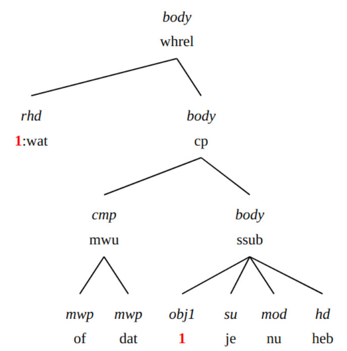

# Zoeken in het GCND-corpus met XPath

Motivatie:
* De example-based search van GrETEL zal voor sommige dialect constructies niet goed werken omdat Alpino de gebruikersinvoer 
niet herkent.  
* Sommige verschijnselen zijn sowieso moeilijk te vatten in de example-based search


Zie ook
* https://hackmd.io/@amghysel/r1kMS8cC9
* Voor een algemeen GrETEL tutorial zie https://surfdrive.surf.nl/files/index.php/s/xfjVB2AfwgOpmNM

## 1. Elliptische constructies, onderbroken zinnen, reparaties....

Syntactisch "onvolledige" zinnen worden in de Alpino-analyses niet aangevuld tot een volledige zin.
Ze zijn (niet geheel betrouwbaar) te vinden als analyses waar geen _smain_ in voorkomt

```xpath
//node[not (ancestor::node)][not (.//node[@cat="smain" or @cat="nucl"])]
```

### 1.1 Elliptische/asyndetische constructies

### 1.2 Eenwoordzinnen


### 1.3 Performance errors, reparaties en onderbroken zinnen

#### 1.3.1 Herformulering en reparatie

Bij een herformulering of reparatie behoudt het corpus enkel _het meeste rechtse element_ voor de parsing. 
De andere elementen worden direct aan de topknoop van de boom gehangen met als dependentielabel '–'.

We kunnen een poging doen zulke gevallen terug te vinden met bijvoorbeeld:
```xpath
//node
   [node[@rel='--' and not (@cat) and not (@pt='let' or @pt='spec')]
       [number(../node[@cat]/@begin) > number(@begin)]]
```

#### 1.4.2. Doen-replieken

A: _Hij komt toch niet?_
B: _Ja hij en doet ne komt._

Positieve positieve en negatieve replieken zijn vindbaar met iets als

```xpath
//node[@lemma="doen"]
   [../node[@rel="su" and @pt="vnw"]]
   [not (../node[@rel="obj1"])]
   [not (../node[@rel="vc"])]
```

##### Negatieve gevallen met _en_

* _bè ik en doe , zei dat kind_

```xpath
//node[@lemma="doen"]
   [../node[@word='en' and @rel="mod" and @pt="bw"]]
   [../node[@rel="su" and @pt="vnw"]]
   [not (../node[@rel="obj1"])]
```

## 2. Subjectsverschijnselen

### 2.1 subjectverdubbeling (of drievoudig subject)

* _Ik heb ik ik dat niet gezegd._
* _en t jij ee t jij zijn kazak gekeerd ._

```xpath
//node[count(./node[@rel='su']) > 1]
```

### 2.1 subject in objectvorm

_omdat hem peinsde dat dat zijn kindje was._

```xpath
//node[@rel="su" and @word="hem"]
```

```xpath
//node[@rel="su" and @naamval="obl"]
```


### 2.3 Presentatief 'het'

Deze constructie wordt noch in de Lassy-handleiding noch in de CGN-beschrijving besproken. 
In het GCND zullen we dit soort het zoals presentatief er behandelen, en het dus het dependentielabel 'MOD' te geven.
Adjectieven met "geen".

Vindbaar met:

```xpath
//node[@rel='mod' and word='het']
```

De resultaten zijn soms een beetje verwarrend

## 3. Uitbreidingen van de zin: TAG en SAT

### Discourse-structuren in de Lassy annotatie

Uit het Lassy-annotatiemanual:

| dependentielabel | OMSCHRIJVING                                                                                                                                                                                            |
|---|---------------------------------------------------------------------------------------------------------------------------------------------------------------------------------------------------------|
| NUCL | kernzin                                                                                                                                                                                                 |
| DLINK | discourse-link In samenhangende tekst komt het vaak voor dat een spreker een zin begint of eindigt met iets dat op een voegwoord lijkt, maar geen syntactisch verband heeft: _maar wat ik zeggen wou ..._ |
| SAT | satelliet: aan- of uitloop ‘aanloop’- en ‘uitloop’-elementen die een anaforische relatie onderhouden met verwijswoorden in de kernzin.  _NUCL:[het verbaast me] SAT:[dat je dat nog weet]_              |
| TAG | aanhangsel, tussenvoegsel. Elementen die op een andere manier dan DLINK en SAT buiten de kernzin staan                                                                                                  |
| DP  | discourse-part                                                                                                                                                                                          |

| categorielabel | OMSCHRIJVING |
|---|---|
| DU  | discourse-unit |

#### 3.1.1 Left dislocation (topicalisatie)

_Jan, die ken ik niet_

Lijkt goed te gaan in Alpino.

Herkenbaar aan rel=sat en cat=np of pos="noun"

```xpath
//node[@rel='sat' and (@cat='np' or @pos='noun')][@begin="0"]
```

Niet altijd te onderscheiden van volgende categorie. Zie ook 3.1.3 "_hangend topic_"

#### 3.1.2. Tussenwerpsels en aansporingen

* _zo, dat was plezant._

* _natuurlijk, moeilijk is het niet._

* _kom, ik ga er maar vandoor._

* _jongens, ik vertrek nu._

Met dit soort structuren kan Alpino doorgaans vlotjes om; preprocessing is dan ook niet nodig.

Geanalyseerd met dependentierelaties tag (voor tussenwerpsel of aansporing) en nucl (voor de eigenlijke zin)
```xpath
//node[@rel='tag' and (@cat="pp" or @pt='bw' or @cat="advp" or @pt="tsw") and @begin="0"][../node[@rel='nucl']]
```

#### 3.1.3. Hanging Topic / Hangend Topic / Nominativus Pendens:

_**mijn vent** wist **hij** ook niet wat dat was en nu komt ..._

Er staat steeds een naamwoordgroep in de eerste positie, die later in de zin door een persoonlijk voornaamwoord (hij, het, zij, hem, haar) wordt opgenomen

Nominale tag-nodes aan het begin van de zin zoek je met

```xpath
//node[@rel='tag' and (@cat='np' or @pos='noun') and @begin="0"]
```

Niet alle matches van deze query zijn daadwerkelijk topicalisaties.

#### 3.1.4. Inversieloos V-later-dan-2 / V>2 / Noninverted V3

_zeg **als je nu trouwt** het zijn altijd voort kosten._

```xpath
//node[@rel="tag" and @cat="cp"]
```


Mogelijk ook: 
```xpath
//node[@rel="tag" and @cat="pp"]
```

_**in de zomer** t e klaar tot sn avonds t negenen_

### 3.2 Ingebedde dislocaties

_Wat vindt u der eigenlijk van dat zulke zinnen dat die zo geanalyseerd worden?_

Zijn getagd met met _SAT_

### 3.3 ja/nee het/ik/…

* _Bwa nee het jong_
* _ja **ja ze** het is heel juist_

```xpath
//node[@rel='tag'][node[@rel='mwp' and @pt='tsw'] and node[@rel='mwp' and @pos='pron']]
```


### 3.4 V2-bijzinnen - pseudodirecte rede

Het is toch geen waar, etc

* _hij zei hij weet het niet_
* _ik zeg gisterenavond , ik moet de auto binnensteken ut tut tut ._
* _ik zeg , steek hem binnen ._

(Laatste met sv1, verschil met smain niet zo duidelijk?)


* Inleidende matrixzin (hij zei):

    Dependentielabel (rel): tag
    Categorielabel (cat): smain

Pseudodirecte rede - V2-bijzin (hij weet het niet):

    Depentielabel (rel): nucl
    Categorielabel (cat): smain (of – bij werkwoordsinitiële zinnen – sv1)

```xpath
//node[./node[@rel='tag' and @cat='smain'] and node[@rel='nucl' and (@cat='smain' or @cat='sv1')]]
```


NB: Alpino parset directe en pseudodirecte redes doorgaans automatisch juist als je een komma toevoegt tussen de matrixzin en de V2-bijzin.


### 3.5 Intercalaties/parentheses/interpositio

Let op: afwijking van Lassy: In het GCND kiezen we ervoor parentheses het dependentielabel TAG te geven en op hetzelfde niveau als de hoofdzin onder te brengen . 


```xpath
//node[@rel='tag' and @cat='smain']
   [number(../node[@cat='smain' and @rel='nucl' and @begin and @end]
/@begin) < @begin]
   [number(../node[@cat='smain' and @rel='nucl' and @begin and @end]/@end) > @begin]
```


## 4. Complementizer-fenomenen

### 4.1 Afwijkende comparatieve voegwoorden (of, als, gelijk als, gelijk of dat)

* _maar het scheelt meer **of de helft** ._
* _dat is veel langer **als dat** ik ik ben ._

Voor 'of' bijvoorbeeld:

```xpath
//node[@rel='obcomp'][./node[@rel='cmp' and @word='of']]
```

Meerwoordige voegwoordelijke combinaties:

```xpath
//node[@rel='obcomp'][./node[@rel='cmp' and @cat='mwu']]
```

### 4.2 Directe rede ingeleid door van

* _ja die zeggen van , als we daar in de tranchée en zaten ..._

Vindbaar met: 

```xpath
//node[@rel="vc"  and @cat="svan"]
```


Bijvoorbeeld beperkt tot combinatie met "zeggen"

```xpath
//node[node[@rel="hd" and @lemma="zeggen"] and node[@rel="vc"  and @cat="svan"]]
```


### 4.3 Expletief dat

#### Type 1: na onderschikkend voegwoord
* Ik weet niet of dat hij komt.
* Om het te zeggen gelijk of dat het is: …
* ik was getrouwd sinds dat hij nog bij het leger was

```xpath
//node[@cat='cp']/node[@rel='cmp' and @cat='mwu'][./node[@word="dat"]]
```

#### Type 2: na vraagwoord
* Ik weet niet wie dat er komt.
* we gaan weer moeten de tijd afwachten wat dat er allemaal gaat voorvallen

```xpath
//node[@word="wie" and @rel="whd"][following-sibling::node[./node[@word="dat" and @pt="vg"]]]
```

#### Type 3: na betrekkelijk voornaamwoord

* _De mens die dat jou moet helpen, zal vloeken._
* _nee ze voor de oorlog veertien achttien was waren er dan nog knechten **die dat** we winter zomer hadden_

```xpath
//node[@word="die" and @rel="rhd"][following-sibling::node[./node[@word="dat" and @pt="vg"]]]
```

#### Type 4: na vraagwoord + of (zeldzaam in Vlaanderen, cf. Lassy-handleiding)

* _Zijn er meer mogelijkheden dan wat of dat je nu hebt?_

(Niet te vinden in corpus)

```xpath
//node[@cat="whsub" and @rel="body" and
     node[@lemma="wat" and @pt="vnw" and @rel="whd"] and
     node[@cat="cp" and @rel="body" and
         node[@cat="mwu" and @rel="cmp" and
            node[@lemma="of" and @pt="vg" and @rel="mwp"] and
            node[@lemma="dat" and @pt="vg" and @rel="mwp"]]]]
```
<!--

-->

### 4.4 Beknopte bijzinnen ingeleid door _voor_ of _van_ in plaats van _om_

* _een restaurant voor te blijven voor te eten_

```xpath
//node[@cat='oti'][./node[@rel='cmp' and @pt='vz' and (@word='voor' or @word='van')]]
```

### 4.5. Afhankelijke ja/nee-vragen ingeleid door _als_ ipv of

* _k weet nie a je da weet ._

```xpath
//node [
  node[@rel="vc"]
    [node[@lemma="als"] and
      node[@rel="body"]] and 
  node[@rel="hd" and @pt="ww"]
  ]
```

Trage query, 23 resultaten voor nu, allemaal west vlaanderen

### 4.6. Bijzin met hoofdzinsvolgorde (V2-bijzin of Nebensätze)

* _Die rol heb ik heel graag gespeeld omdat **er zat poëzie in**._
* _awaar , da zij smokkelden patatten en ..._


Hoofdzinvolgorde wordt gekenmerkt door
* object na werkwoordelijk hoofd
* of subject na werkwoordelijk hoofd
* Let op object kan in VC zitten
* Let op _omdat zij wil broodjes eten_ etc zijn weliswaar te duiden als hoofdzinvolgorden, maar ook als WW-clusteronderbrekingen  

Object is losstaand znw (dus geen _VC_ node aanwezig in boom):
```xpath
//node[@cat='ssub'][
node[@rel='hd' and @pt='ww'][number(../node[@rel='obj1' and @word and @pt='n']/@begin)  > number(@begin)]
]
```

Object zit binnen VC (dit overlapt met de vlaamse clusterdoorbreking)
```xpath
//node[@cat='ssub'][
node[@rel='hd' and @pt='ww'][number(../node[@rel='vc'][node[@rel="obj1" and @pt="n"]]/@begin)  > number(@begin)]
]
```

Subject na werkwoordelijk hoofd:
```xpath
//node[@cat='ssub']
     [node[@rel='hd' and @pt='ww'][number(../node[@rel='su'][1]/@begin)  > number(@begin)]]
```

Lastig .... even later meer doorklooien
```xpath2
declare default element namespace "http://alpino.fake.url";
for $node in //node[@cat='ssub'][not (.//node[@index])]
     [node[@rel='hd' and @pt='ww'][count(../node[@rel='su']) = 1][number(../node[@rel='su' and @word][.//@word][1]/@begin)  > number(@begin)]] 
let     $sentence := $node/ancestor::*[local-name()='alpino_ds']/sentence,
  $txt := string-join($node//@word, ' ')
return <node>{$node} <text>{$txt}</text> {$sentence}</node>
```

## 5. Negatieverschijnselen (o.a. negatiepartikel en en dubbele negatie)

### 5.1. Dubbele negatie

* (a) Ik en heb dat niet gezegd.
* (b) Ik heb niemand niet gezien.
* (c ) Ik heb niets niet gedaan.
* (d) Ik heb dat nooit niet gedaan.
* (e) Daar zijn nooit geen rozen.
* (f) Ik heb geen boeken niet meer.
* (g) Er zijn er niet veel niet meer.
* (h) Ik heb niet veel geen boeken meer.

#### Negatie met het oude negatiepartikel en (zin a)

Alpino ziet _en_ standaard als voegwoord.

Negatie met _en_ is terug te vinden met een xpath als

```xpath
//node[./node[@rel='mod' and @word='en' and @pt='bw']]
```

* _ze **en** hebben **geen** redenen van klagen_

```xpath
//node
   [./node[@rel='mod' and @word='en' and @pt='bw']]
   [node[@cat='np'][node[@rel='det' and @lemma='geen' and @pt='vnw']]]
```


#### Negatieverdubbeling binnen de nominale constituent (zin h)

Is behandeld als een meerwoordige determiner.

Complexe determiners waar _niet_ deel van is, zijn te zoeken met
```xpath
//node[@rel="det" and @cat="mwu"]
   [node[@lemma="niet"]]
```

