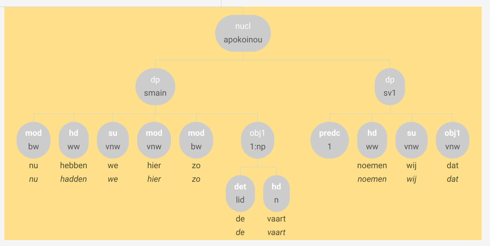

# Zoeken in het GCND-corpus met XPath

Motivatie:
* De example-based search van GrETEL zal voor sommige dialect constructies niet goed werken omdat Alpino de gebruikersinvoer 
niet herkent.  
* Sommige verschijnselen zijn sowieso moeilijk te vatten in de example-based search


Zie ook
* https://hackmd.io/@amghysel/r1kMS8cC9
* Voor een algemeen GrETEL tutorial zie https://surfdrive.surf.nl/files/index.php/s/xfjVB2AfwgOpmNM
* Ook https://paqu.let.rug.nl:8068/info.html#re 


## 1. Subjectsverschijnselen

### 1.1 subjectverdubbeling (of drievoudig subject)

* _Ik heb ik ik dat niet gezegd._
* _en t jij ee t jij zijn kazak gekeerd ._

```xpath
//node[count(./node[@rel='su']) > 1]
```
[link](https://gretel5.ato.ivdnt.org/xpath-search?currentStep=2&xpath=%0A//node%5Bcount%28./node%5B%40rel%3D%27su%27%5D%29%20%3E%201%5D%0A&selectedTreebanks=%7B%22gretel%22:%7B%22gcnd_24-09-2024%22:%5B%22main%22%5D%7D%7D&retrieveContext=0)

### 1.1 subject in objectvorm

_omdat hem peinsde dat dat zijn kindje was._

```xpath
//node[@rel="su" and @word="hem"]
```
[link](https://gretel5.ato.ivdnt.org/xpath-search?currentStep=2&xpath=%0A//node%5B%40rel%3D%22su%22%20and%20%40word%3D%22hem%22%5D%0A&selectedTreebanks=%7B%22gretel%22:%7B%22gcnd_24-09-2024%22:%5B%22main%22%5D%7D%7D&retrieveContext=0)

Iets algemener:

```xpath
//node[@rel="su" and @naamval="obl"]
```
[link](https://gretel5.ato.ivdnt.org/xpath-search?currentStep=2&xpath=%0A//node%5B%40rel%3D%22su%22%20and%20%40naamval%3D%22obl%22%5D%0A&selectedTreebanks=%7B%22gretel%22:%7B%22gcnd_24-09-2024%22:%5B%22main%22%5D%7D%7D&retrieveContext=0)


### 1.3 Presentatief 'het'

Deze constructie wordt noch in de Lassy-handleiding noch in de CGN-beschrijving besproken.
In het GCND is dit _het_ zoals presentatief _er_ behandeld, en heeft _het_ dus het dependentielabel _MOD_.

?Adjectieven met "geen".

Vindbaar met:

```xpath
//node[@rel='mod' and word='het']
```
[link](https://gretel5.ato.ivdnt.org/xpath-search?currentStep=2&xpath=%0A//node%5B%40rel%3D%27mod%27%20and%20word%3D%27het%27%5D%0A&selectedTreebanks=%7B%22gretel%22:%7B%22gcnd_24-09-2024%22:%5B%22main%22%5D%7D%7D&retrieveContext=0)

De resultaten zijn soms een beetje verwarrend


## 2. Uitbreidingen van de zin: TAG en SAT

### Discourse-structuren in de Lassy annotatie

Uit het Lassy-annotatiemanual:

| dependentielabel | OMSCHRIJVING                                                                                                                                                                                            |
|---|---------------------------------------------------------------------------------------------------------------------------------------------------------------------------------------------------------|
| NUCL | kernzin                                                                                                                                                                                                 |
| DLINK | discourse-link In samenhangende tekst komt het vaak voor dat een spreker een zin begint of eindigt met iets dat op een voegwoord lijkt, maar geen syntactisch verband heeft: _maar wat ik zeggen wou ..._ |
| SAT | satelliet: aan- of uitloop ‘aanloop’- en ‘uitloop’-elementen die een anaforische relatie onderhouden met verwijswoorden in de kernzin.  _NUCL:[het verbaast me] SAT:[dat je dat nog weet]_              |
| TAG | aanhangsel, tussenvoegsel. Elementen die op een andere manier dan DLINK en SAT buiten de kernzin staan                                                                                                  |
| DP  | discourse-part                                                                                                                                                                                          |

| categorielabel | OMSCHRIJVING |
|---|---|
| DU  | discourse-unit |


### 2.1 Linker zinsperiferie

#### 2.1.a Aanloopconstructie (Left dislocation)

_Jan, die ken ik niet_

Dit goed te gaan in Alpino, en kan dus via example-based search worden gevonden.

Herkenbaar aan dependentierelatie _SAT_ en (categorie _np_ of woordsoort zelfstandig naamwoord (_n_).

```xpath
//node[@rel='sat' and (@cat='np' or @pt='n')][@begin="0"]
```
[link](https://gretel5.ato.ivdnt.org/xpath-search?currentStep=2&xpath=%0A//node%5B%40rel%3D%27sat%27%20and%20%28%40cat%3D%27np%27%20or%20%40pt%3D%27n%27%29%5D%5B%40begin%3D%220%22%5D%0A&selectedTreebanks=%7B%22gretel%22:%7B%22gcnd_24-09-2024%22:%5B%22main%22%5D%7D%7D&retrieveContext=0)

Niet altijd makkelijk te onderscheiden van volgende categorie. 

##### 2.1.b Hanging Topic / Hangend Topic / Nominativus Pendens:

_**mijn vent** wist **hij** ook niet wat dat was en nu komt ..._

Er staat steeds een naamwoordgroep in de eerste positie, die later in de zin door een persoonlijk voornaamwoord (hij, het, zij, hem, haar) wordt opgenomen

Nominale tag-nodes aan het begin van de zin zoek je met

```xpath
//node[@rel='tag' and (@cat='np' or @pos='noun') and @begin="0"]
```
[link](https://gretel5.ato.ivdnt.org/xpath-search?currentStep=2&xpath=%0A//node%5B%40rel%3D%27tag%27%20and%20%28%40cat%3D%27np%27%20or%20%40pos%3D%27noun%27%29%20and%20%40begin%3D%220%22%5D%0A&selectedTreebanks=%7B%22gretel%22:%7B%22gcnd_24-09-2024%22:%5B%22main%22%5D%7D%7D&retrieveContext=0)

Niet alle matches van deze query zijn daadwerkelijk topicalisaties.

#### 2.1.c Tussenwerpsels en aansporingen

* _zo, dat was plezant._

* _natuurlijk, moeilijk is het niet._

* _kom, ik ga er maar vandoor._

* _jongens, ik vertrek nu._

Met dit soort structuren kan Alpino doorgaans vlotjes om; preprocessing is dan ook niet nodig.

Geanalyseerd met dependentierelaties tag (voor tussenwerpsel of aansporing) en nucl (voor de eigenlijke zin)
```xpath
//node[@rel='tag' and (@cat="pp" or @pt='bw' or @cat="advp" or @pt="tsw") and @begin="0"][../node[@rel='nucl']]
```
[link](https://gretel5.ato.ivdnt.org/xpath-search?currentStep=2&xpath=%0A//node%5B%40rel%3D%27tag%27%20and%20%28%40cat%3D%22pp%22%20or%20%40pt%3D%27bw%27%20or%20%40cat%3D%22advp%22%20or%20%40pt%3D%22tsw%22%29%20and%20%40begin%3D%220%22%5D%5B../node%5B%40rel%3D%27nucl%27%5D%5D%0A&selectedTreebanks=%7B%22gretel%22:%7B%22gcnd_24-09-2024%22:%5B%22main%22%5D%7D%7D&retrieveContext=0)

#### 2.1.d Inversieloos V-later-dan-2 / V>2 / Noninverted V3

_zeg **als je nu trouwt** het zijn altijd voort kosten._

```xpath
//node[@rel="tag" and @cat="cp"]
```
[link](https://gretel5.ato.ivdnt.org/xpath-search?currentStep=2&xpath=%0A//node%5B%40rel%3D%22tag%22%20and%20%40cat%3D%22cp%22%5D%0A&selectedTreebanks=%7B%22gretel%22:%7B%22gcnd_24-09-2024%22:%5B%22main%22%5D%7D%7D&retrieveContext=0)


Mogelijk ook:
```xpath
//node[@rel="tag" and @cat="pp"]
```
[link](https://gretel5.ato.ivdnt.org/xpath-search?currentStep=2&xpath=%0A//node%5B%40rel%3D%22tag%22%20and%20%40cat%3D%22pp%22%5D%0A&selectedTreebanks=%7B%22gretel%22:%7B%22gcnd_24-09-2024%22:%5B%22main%22%5D%7D%7D&retrieveContext=0)

_**in de zomer** t e klaar tot sn avonds t negenen_


#### 2.1.e Ingebedde dislocaties

_Wat vindt u der eigenlijk van dat zulke zinnen dat die zo geanalyseerd worden?_

Zijn getagd met met _SAT_

#### 2.1.f ja/nee het/ik/…

* _Bwa nee het jong_
* _ja **ja ze** het is heel juist_

```xpath
//node[@rel='tag'][node[@rel='mwp' and @pt='tsw'] and node[@rel='mwp' and @pos='pron']]
```
[link](https://gretel5.ato.ivdnt.org/xpath-search?currentStep=2&xpath=%0A//node%5B%40rel%3D%27tag%27%5D%5Bnode%5B%40rel%3D%27mwp%27%20and%20%40pt%3D%27tsw%27%5D%20and%20node%5B%40rel%3D%27mwp%27%20and%20%40pos%3D%27pron%27%5D%5D%0A&selectedTreebanks=%7B%22gretel%22:%7B%22gcnd_24-09-2024%22:%5B%22main%22%5D%7D%7D&retrieveContext=0)


### 2.2 V2-bijzinnen - pseudodirecte rede

Het is toch geen waar, etc

* _hij zei hij weet het niet_
* _ik zeg gisterenavond , ik moet de auto binnensteken ut tut tut ._
* _ik zeg , steek hem binnen ._

(Laatste met sv1, verschil met smain niet zo duidelijk?)

* Inleidende matrixzin (hij zei):

  Dependentielabel (rel): tag
  Categorielabel (cat): smain

Pseudodirecte rede - V2-bijzin (hij weet het niet):

    Depentielabel (rel): nucl
    Categorielabel (cat): smain (of – bij werkwoordsinitiële zinnen – sv1)

```xpath
//node[./node[@rel='tag' and @cat='smain'] and node[@rel='nucl' and (@cat='smain' or @cat='sv1')]]
```
[link](https://gretel5.ato.ivdnt.org/xpath-search?currentStep=2&xpath=%0A//node%5B./node%5B%40rel%3D%27tag%27%20and%20%40cat%3D%27smain%27%5D%20and%20node%5B%40rel%3D%27nucl%27%20and%20%28%40cat%3D%27smain%27%20or%20%40cat%3D%27sv1%27%29%5D%5D%0A&selectedTreebanks=%7B%22gretel%22:%7B%22gcnd_24-09-2024%22:%5B%22main%22%5D%7D%7D&retrieveContext=0)


NB: Alpino parset directe en pseudodirecte redes doorgaans automatisch juist als je een komma toevoegt tussen de matrixzin en de V2-bijzin.


### 2.3 Intercalaties/parentheses/interpositio

Let op: afwijking van Lassy: In het GCND kiezen we ervoor parentheses het dependentielabel TAG te geven en op hetzelfde niveau als de hoofdzin onder te brengen .


```xpath
//node[@rel='tag' and @cat='smain']
   [number(../node[@cat='smain' and @rel='nucl' and @begin and @end]
/@begin) < @begin]
   [number(../node[@cat='smain' and @rel='nucl' and @begin and @end]/@end) > @begin]
```
[link](https://gretel5.ato.ivdnt.org/xpath-search?currentStep=2&xpath=%0A//node%5B%40rel%3D%27tag%27%20and%20%40cat%3D%27smain%27%5D%0A%20%20%20%5Bnumber%28../node%5B%40cat%3D%27smain%27%20and%20%40rel%3D%27nucl%27%20and%20%40begin%20and%20%40end%5D%0A/%40begin%29%20%3C%20%40begin%5D%0A%20%20%20%5Bnumber%28../node%5B%40cat%3D%27smain%27%20and%20%40rel%3D%27nucl%27%20and%20%40begin%20and%20%40end%5D/%40end%29%20%3E%20%40begin%5D%0A&selectedTreebanks=%7B%22gretel%22:%7B%22gcnd_24-09-2024%22:%5B%22main%22%5D%7D%7D&retrieveContext=0)


## 3. Complementizer-fenomenen

### 3.1 Afwijkende comparatieve voegwoorden (of, als, gelijk als, gelijk of dat)

* _maar het scheelt meer **of de helft** ._
* _dat is veel langer **als dat** ik ik ben ._

Voor 'of' bijvoorbeeld:

```xpath
//node[@rel='obcomp'][./node[@rel='cmp' and @word='of']]
```
[link](https://gretel5.ato.ivdnt.org/xpath-search?currentStep=2&xpath=%0A//node%5B%40rel%3D%27obcomp%27%5D%5B./node%5B%40rel%3D%27cmp%27%20and%20%40word%3D%27of%27%5D%5D%0A&selectedTreebanks=%7B%22gretel%22:%7B%22gcnd_24-09-2024%22:%5B%22main%22%5D%7D%7D&retrieveContext=0)

Meerwoordige voegwoordelijke combinaties:

```xpath
//node[@rel='obcomp'][./node[@rel='cmp' and @cat='mwu']]
```
[link](https://gretel5.ato.ivdnt.org/xpath-search?currentStep=2&xpath=%0A//node%5B%40rel%3D%27obcomp%27%5D%5B./node%5B%40rel%3D%27cmp%27%20and%20%40cat%3D%27mwu%27%5D%5D%0A&selectedTreebanks=%7B%22gretel%22:%7B%22gcnd_24-09-2024%22:%5B%22main%22%5D%7D%7D&retrieveContext=0)

### 3.2 Directe rede ingeleid door van

* _ja die zeggen van , als we daar in de tranchée en zaten ..._

Vindbaar met:

```xpath
//node[@rel="vc"  and @cat="svan"]
```
[link](https://gretel5.ato.ivdnt.org/xpath-search?currentStep=2&xpath=%0A//node%5B%40rel%3D%22vc%22%20%20and%20%40cat%3D%22svan%22%5D%0A&selectedTreebanks=%7B%22gretel%22:%7B%22gcnd_24-09-2024%22:%5B%22main%22%5D%7D%7D&retrieveContext=0)


Bijvoorbeeld beperkt tot combinatie met "zeggen"

```xpath
//node[node[@rel="hd" and @lemma="zeggen"] and node[@rel="vc"  and @cat="svan"]]
```
[link](https://gretel5.ato.ivdnt.org/xpath-search?currentStep=2&xpath=%0A//node%5Bnode%5B%40rel%3D%22hd%22%20and%20%40lemma%3D%22zeggen%22%5D%20and%20node%5B%40rel%3D%22vc%22%20%20and%20%40cat%3D%22svan%22%5D%5D%0A&selectedTreebanks=%7B%22gretel%22:%7B%22gcnd_24-09-2024%22:%5B%22main%22%5D%7D%7D&retrieveContext=0)


### 3.3 Expletief dat

#### Type 1: na onderschikkend voegwoord
* Ik weet niet of dat hij komt.
* Om het te zeggen gelijk of dat het is: …
* ik was getrouwd sinds dat hij nog bij het leger was

```xpath
//node[@cat='cp']/node[@rel='cmp' and @cat='mwu'][./node[@word="dat"]]
```
[link](https://gretel5.ato.ivdnt.org/xpath-search?currentStep=2&xpath=%0A//node%5B%40cat%3D%27cp%27%5D/node%5B%40rel%3D%27cmp%27%20and%20%40cat%3D%27mwu%27%5D%5B./node%5B%40word%3D%22dat%22%5D%5D%0A&selectedTreebanks=%7B%22gretel%22:%7B%22gcnd_24-09-2024%22:%5B%22main%22%5D%7D%7D&retrieveContext=0)

#### Type 2: na vraagwoord
* Ik weet niet wie dat er komt.
* we gaan weer moeten de tijd afwachten wat dat er allemaal gaat voorvallen

```xpath
//node[@word="wie" and @rel="whd"][following-sibling::node[./node[@word="dat" and @pt="vg"]]]
```
[link](https://gretel5.ato.ivdnt.org/xpath-search?currentStep=2&xpath=%0A//node%5B%40word%3D%22wie%22%20and%20%40rel%3D%22whd%22%5D%5Bfollowing-sibling%3A%3Anode%5B./node%5B%40word%3D%22dat%22%20and%20%40pt%3D%22vg%22%5D%5D%5D%0A&selectedTreebanks=%7B%22gretel%22:%7B%22gcnd_24-09-2024%22:%5B%22main%22%5D%7D%7D&retrieveContext=0)

#### Type 3: na betrekkelijk voornaamwoord

* _De mens die dat jou moet helpen, zal vloeken._
* _nee ze voor de oorlog veertien achttien was waren er dan nog knechten **die dat** we winter zomer hadden_

```xpath
//node[@word="die" and @rel="rhd"][following-sibling::node[./node[@word="dat" and @pt="vg"]]]
```
[link](https://gretel5.ato.ivdnt.org/xpath-search?currentStep=2&xpath=%0A//node%5B%40word%3D%22die%22%20and%20%40rel%3D%22rhd%22%5D%5Bfollowing-sibling%3A%3Anode%5B./node%5B%40word%3D%22dat%22%20and%20%40pt%3D%22vg%22%5D%5D%5D%0A&selectedTreebanks=%7B%22gretel%22:%7B%22gcnd_24-09-2024%22:%5B%22main%22%5D%7D%7D&retrieveContext=0)

#### Type 4: na vraagwoord + of (zeldzaam in Vlaanderen, cf. Lassy-handleiding)

* _Zijn er meer mogelijkheden dan wat of dat je nu hebt?_

(Niet te vinden in corpus)

```xpath
//node[@cat="whsub" and @rel="body" and
     node[@lemma="wat" and @pt="vnw" and @rel="whd"] and
     node[@cat="cp" and @rel="body" and
         node[@cat="mwu" and @rel="cmp" and
            node[@lemma="of" and @pt="vg" and @rel="mwp"] and
            node[@lemma="dat" and @pt="vg" and @rel="mwp"]]]]
```
[link](https://gretel5.ato.ivdnt.org/xpath-search?currentStep=2&xpath=%0A//node%5B%40cat%3D%22whsub%22%20and%20%40rel%3D%22body%22%20and%0A%20%20%20%20%20node%5B%40lemma%3D%22wat%22%20and%20%40pt%3D%22vnw%22%20and%20%40rel%3D%22whd%22%5D%20and%0A%20%20%20%20%20node%5B%40cat%3D%22cp%22%20and%20%40rel%3D%22body%22%20and%0A%20%20%20%20%20%20%20%20%20node%5B%40cat%3D%22mwu%22%20and%20%40rel%3D%22cmp%22%20and%0A%20%20%20%20%20%20%20%20%20%20%20%20node%5B%40lemma%3D%22of%22%20and%20%40pt%3D%22vg%22%20and%20%40rel%3D%22mwp%22%5D%20and%0A%20%20%20%20%20%20%20%20%20%20%20%20node%5B%40lemma%3D%22dat%22%20and%20%40pt%3D%22vg%22%20and%20%40rel%3D%22mwp%22%5D%5D%5D%5D%0A&selectedTreebanks=%7B%22gretel%22:%7B%22gcnd_24-09-2024%22:%5B%22main%22%5D%7D%7D&retrieveContext=0)
<!--

-->

### 3.4 Beknopte bijzinnen ingeleid door _voor_ of _van_ in plaats van _om_

* _een restaurant voor te blijven voor te eten_

```xpath
//node[@cat='oti'][./node[@rel='cmp' and @pt='vz' and (@word='voor' or @word='van')]]
```
[link](https://gretel5.ato.ivdnt.org/xpath-search?currentStep=2&xpath=%0A//node%5B%40cat%3D%27oti%27%5D%5B./node%5B%40rel%3D%27cmp%27%20and%20%40pt%3D%27vz%27%20and%20%28%40word%3D%27voor%27%20or%20%40word%3D%27van%27%29%5D%5D%0A&selectedTreebanks=%7B%22gretel%22:%7B%22gcnd_24-09-2024%22:%5B%22main%22%5D%7D%7D&retrieveContext=0)

### 3.5. Afhankelijke ja/nee-vragen ingeleid door _als_ ipv of

* _k weet nie a je da weet ._

```xpath
//node [
  node[@rel="vc"]
    [node[@lemma="als"] and
      node[@rel="body"]] and 
  node[@rel="hd" and @pt="ww"]
  ]
```
[link](https://gretel5.ato.ivdnt.org/xpath-search?currentStep=2&xpath=%0A//node%20%5B%0A%20%20node%5B%40rel%3D%22vc%22%5D%0A%20%20%20%20%5Bnode%5B%40lemma%3D%22als%22%5D%20and%0A%20%20%20%20%20%20node%5B%40rel%3D%22body%22%5D%5D%20and%20%0A%20%20node%5B%40rel%3D%22hd%22%20and%20%40pt%3D%22ww%22%5D%0A%20%20%5D%0A&selectedTreebanks=%7B%22gretel%22:%7B%22gcnd_24-09-2024%22:%5B%22main%22%5D%7D%7D&retrieveContext=0)

Trage query, 23 resultaten voor nu, allemaal west vlaanderen

### 3.6. Bijzin met hoofdzinsvolgorde (V2-bijzin of Nebensätze)

* _Die rol heb ik heel graag gespeeld omdat **er zat poëzie in**._
* _awaar , da zij smokkelden patatten en ..._


Hoofdzinvolgorde wordt gekenmerkt door
* object na werkwoordelijk hoofd
* of subject na werkwoordelijk hoofd
* Let op object kan in VC zitten
* Let op _omdat zij wil broodjes eten_ etc zijn weliswaar te duiden als hoofdzinvolgorden, maar ook als WW-clusteronderbrekingen

Object is losstaand znw (dus geen _VC_ node aanwezig in boom):
```xpath
//node[@cat='ssub'][
node[@rel='hd' and @pt='ww'][number(../node[@rel='obj1' and @word and @pt='n']/@begin)  > number(@begin)]
]
```
[link](https://gretel5.ato.ivdnt.org/xpath-search?currentStep=2&xpath=%0A//node%5B%40cat%3D%27ssub%27%5D%5B%0Anode%5B%40rel%3D%27hd%27%20and%20%40pt%3D%27ww%27%5D%5Bnumber%28../node%5B%40rel%3D%27obj1%27%20and%20%40word%20and%20%40pt%3D%27n%27%5D/%40begin%29%20%20%3E%20number%28%40begin%29%5D%0A%5D%0A&selectedTreebanks=%7B%22gretel%22:%7B%22gcnd_24-09-2024%22:%5B%22main%22%5D%7D%7D&retrieveContext=0)

Object zit binnen VC (dit overlapt met de vlaamse clusterdoorbreking)
```xpath
//node[@cat='ssub'][
node[@rel='hd' and @pt='ww'][number(../node[@rel='vc'][node[@rel="obj1" and @pt="n"]]/@begin)  > number(@begin)]
]
```
[link](https://gretel5.ato.ivdnt.org/xpath-search?currentStep=2&xpath=%0A//node%5B%40cat%3D%27ssub%27%5D%5B%0Anode%5B%40rel%3D%27hd%27%20and%20%40pt%3D%27ww%27%5D%5Bnumber%28../node%5B%40rel%3D%27vc%27%5D%5Bnode%5B%40rel%3D%22obj1%22%20and%20%40pt%3D%22n%22%5D%5D/%40begin%29%20%20%3E%20number%28%40begin%29%5D%0A%5D%0A&selectedTreebanks=%7B%22gretel%22:%7B%22gcnd_24-09-2024%22:%5B%22main%22%5D%7D%7D&retrieveContext=0)

Subject na werkwoordelijk hoofd:
```xpath
//node[@cat='ssub']
     [node[@rel='hd' and @pt='ww'][number(../node[@rel='su'][1]/@begin)  > number(@begin)]]
```
[link](https://gretel5.ato.ivdnt.org/xpath-search?currentStep=2&xpath=%0A//node%5B%40cat%3D%27ssub%27%5D%0A%20%20%20%20%20%5Bnode%5B%40rel%3D%27hd%27%20and%20%40pt%3D%27ww%27%5D%5Bnumber%28../node%5B%40rel%3D%27su%27%5D%5B1%5D/%40begin%29%20%20%3E%20number%28%40begin%29%5D%5D%0A&selectedTreebanks=%7B%22gretel%22:%7B%22gcnd_24-09-2024%22:%5B%22main%22%5D%7D%7D&retrieveContext=0)

Lastig .... even later meer doorklooien
```xpath2
declare default element namespace "http://alpino.fake.url";
for $node in //node[@cat='ssub'][not (.//node[@index])]
     [node[@rel='hd' and @pt='ww'][count(../node[@rel='su']) = 1][number(../node[@rel='su' and @word][.//@word][1]/@begin)  > number(@begin)]] 
let     $sentence := $node/ancestor::*[local-name()='alpino_ds']/sentence,
  $txt := string-join($node//@word, ' ')
return <node>{$node} <text>{$txt}</text> {$sentence}</node>
```
[link](https://gretel5.ato.ivdnt.org/xpath-search?currentStep=2&xpath=2%0Adeclare%20default%20element%20namespace%20%22http%3A//alpino.fake.url%22%3B%0Afor%20%24node%20in%20//node%5B%40cat%3D%27ssub%27%5D%5Bnot%20%28.//node%5B%40index%5D%29%5D%0A%20%20%20%20%20%5Bnode%5B%40rel%3D%27hd%27%20and%20%40pt%3D%27ww%27%5D%5Bcount%28../node%5B%40rel%3D%27su%27%5D%29%20%3D%201%5D%5Bnumber%28../node%5B%40rel%3D%27su%27%20and%20%40word%5D%5B.//%40word%5D%5B1%5D/%40begin%29%20%20%3E%20number%28%40begin%29%5D%5D%20%0Alet%20%20%20%20%20%24sentence%20%3A%3D%20%24node/ancestor%3A%3A%2A%5Blocal-name%28%29%3D%27alpino_ds%27%5D/sentence%2C%0A%20%20%24txt%20%3A%3D%20string-join%28%24node//%40word%2C%20%27%20%27%29%0Areturn%20%3Cnode%3E%7B%24node%7D%20%3Ctext%3E%7B%24txt%7D%3C/text%3E%20%7B%24sentence%7D%3C/node%3E%0A&selectedTreebanks=%7B%22gretel%22:%7B%22gcnd_24-09-2024%22:%5B%22main%22%5D%7D%7D&retrieveContext=0)

## 4. Negatieverschijnselen (o.a. negatiepartikel en en dubbele negatie)

### 4.1. Dubbele negatie

* (a) Ik en heb dat niet gezegd.
* (b) Ik heb niemand niet gezien.
* (c ) Ik heb niets niet gedaan.
* (d) Ik heb dat nooit niet gedaan.
* (e) Daar zijn nooit geen rozen.
* (f) Ik heb geen boeken niet meer.
* (g) Er zijn er niet veel niet meer.
* (h) Ik heb niet veel geen boeken meer.

#### Negatie met het oude negatiepartikel en (zin a)

Alpino ziet _en_ standaard als voegwoord.

Negatie met _en_ is terug te vinden met een xpath als

```xpath
//node[./node[@rel='mod' and @word='en' and @pt='bw']]
```
[link](https://gretel5.ato.ivdnt.org/xpath-search?currentStep=2&xpath=%0A//node%5B./node%5B%40rel%3D%27mod%27%20and%20%40word%3D%27en%27%20and%20%40pt%3D%27bw%27%5D%5D%0A&selectedTreebanks=%7B%22gretel%22:%7B%22gcnd_24-09-2024%22:%5B%22main%22%5D%7D%7D&retrieveContext=0)

* _ze **en** hebben **geen** redenen van klagen_

```xpath
//node
   [./node[@rel='mod' and @word='en' and @pt='bw']]
   [node[@cat='np'][node[@rel='det' and @lemma='geen' and @pt='vnw']]]
```
[link](https://gretel5.ato.ivdnt.org/xpath-search?currentStep=2&xpath=%0A//node%0A%20%20%20%5B./node%5B%40rel%3D%27mod%27%20and%20%40word%3D%27en%27%20and%20%40pt%3D%27bw%27%5D%5D%0A%20%20%20%5Bnode%5B%40cat%3D%27np%27%5D%5Bnode%5B%40rel%3D%27det%27%20and%20%40lemma%3D%27geen%27%20and%20%40pt%3D%27vnw%27%5D%5D%5D%0A&selectedTreebanks=%7B%22gretel%22:%7B%22gcnd_24-09-2024%22:%5B%22main%22%5D%7D%7D&retrieveContext=0)


#### Negatieverdubbeling binnen de nominale constituent (zin h)

Is behandeld als een meerwoordige determiner.

Complexe determiners waar _niet_ deel van is, zijn te zoeken met
```xpath
//node[@rel="det" and @cat="mwu"]
   [node[@lemma="niet"]]
```
[link](https://gretel5.ato.ivdnt.org/xpath-search?currentStep=2&xpath=%0A//node%5B%40rel%3D%22det%22%20and%20%40cat%3D%22mwu%22%5D%0A%20%20%20%5Bnode%5B%40lemma%3D%22niet%22%5D%5D%0A&selectedTreebanks=%7B%22gretel%22:%7B%22gcnd_24-09-2024%22:%5B%22main%22%5D%7D%7D&retrieveContext=0)


### 4.2 Adjectieven die met 'geen' gecombineerd worden

* Dat is _geen waar_

!NB zou moeten zijn

```xpath
node[node[@rel='hd' and @pt='ADJ'] and node[@rel='det' and lemma='geen']]
```
[link](https://gretel5.ato.ivdnt.org/xpath-search?currentStep=2&xpath=%0Anode%5Bnode%5B%40rel%3D%27hd%27%20and%20%40pt%3D%27ADJ%27%5D%20and%20node%5B%40rel%3D%27det%27%20and%20lemma%3D%27geen%27%5D%5D%0A&selectedTreebanks=%7B%22gretel%22:%7B%22gcnd_24-09-2024%22:%5B%22main%22%5D%7D%7D&retrieveContext=0)

Maar in de het corpus heeft in ieder geval _waar_ vaak de n-tag,

### 4.3 Doen-replieken

A: _Hij komt toch niet?_
B: _Ja hij en doet ne komt._


Positieve positieve en negatieve replieken zijn vindbaar met iets als

```xpath
//node[@lemma="doen" and @pvtijd='tgw']
   [parent::node[@cat='smain']]
   [../node[@rel="su" and @pt="vnw"]]
   [not (../node[@rel="obj1"])]
   [not (../node[@rel="vc" or @rel="predc"])]
```
[link](https://gretel5.ato.ivdnt.org/xpath-search?currentStep=2&xpath=%0A//node%5B%40lemma%3D%22doen%22%20and%20%40pvtijd%3D%27tgw%27%5D%0A%20%20%20%5Bparent%3A%3Anode%5B%40cat%3D%27smain%27%5D%5D%0A%20%20%20%5B../node%5B%40rel%3D%22su%22%20and%20%40pt%3D%22vnw%22%5D%5D%0A%20%20%20%5Bnot%20%28../node%5B%40rel%3D%22obj1%22%5D%29%5D%0A%20%20%20%5Bnot%20%28../node%5B%40rel%3D%22vc%22%20or%20%40rel%3D%22predc%22%5D%29%5D%0A&selectedTreebanks=%7B%22gretel%22:%7B%22gcnd_24-09-2024%22:%5B%22main%22%5D%7D%7D&retrieveContext=0)

##### Negatieve gevallen met _en_

* _bè ik en doe , zei dat kind_

```xpath
//node[@lemma="doen" and @pvtijd='tgw']
   [../node[@word='en' and @rel="mod" and @pt="bw"]]
   [parent::node[@cat='smain']]
   [../node[@rel="su" and @pt="vnw"]]
   [not (../node[@rel="obj1"])]
   [not (../node[@rel="vc" or @rel="predc"])]
```
[link](https://gretel5.ato.ivdnt.org/xpath-search?currentStep=2&xpath=%0A//node%5B%40lemma%3D%22doen%22%20and%20%40pvtijd%3D%27tgw%27%5D%0A%20%20%20%5B../node%5B%40word%3D%27en%27%20and%20%40rel%3D%22mod%22%20and%20%40pt%3D%22bw%22%5D%5D%0A%20%20%20%5Bparent%3A%3Anode%5B%40cat%3D%27smain%27%5D%5D%0A%20%20%20%5B../node%5B%40rel%3D%22su%22%20and%20%40pt%3D%22vnw%22%5D%5D%0A%20%20%20%5Bnot%20%28../node%5B%40rel%3D%22obj1%22%5D%29%5D%0A%20%20%20%5Bnot%20%28../node%5B%40rel%3D%22vc%22%20or%20%40rel%3D%22predc%22%5D%29%5D%0A&selectedTreebanks=%7B%22gretel%22:%7B%22gcnd_24-09-2024%22:%5B%22main%22%5D%7D%7D&retrieveContext=0)

## 5 Andere

### 5.1 en zo/ of zo / en al / en alles / maar ja / en si en la

Behandeld als een multi-word unit (MWU) die als modificeerder fungeert (MOD).

```xpath

```
[link](https://gretel5.ato.ivdnt.org/xpath-search?currentStep=2&xpath=%0A%0A&selectedTreebanks=%7B%22gretel%22:%7B%22gcnd_24-09-2024%22:%5B%22main%22%5D%7D%7D&retrieveContext=0)

### 6.2 woordherhaling

Het woord wordt 2x opgenomen, met hetzelfde dependentielabel.

### 6.3 Spiegelconstructies

* je gebruikt nog alsan diezelfde potees gebruik je.
* het is verder is het.
* Ik zeg :"je bent gek", zeg ik.

Hier worden volgens de richtlijnen twee verbalen hoofden en twee subjecten getagd (mag dat wel? is meer dan een _hd_ niet tegen de principes van Alpino?). In xpath:

```xpath
node[count(./node[@rel='su']) =2 and count(./node[@rel='hd']) =2]  
```
[link](https://gretel5.ato.ivdnt.org/xpath-search?currentStep=2&xpath=%0Anode%5Bcount%28./node%5B%40rel%3D%27su%27%5D%29%20%3D2%20and%20count%28./node%5B%40rel%3D%27hd%27%5D%29%20%3D2%5D%20%20%0A&selectedTreebanks=%7B%22gretel%22:%7B%22gcnd_24-09-2024%22:%5B%22main%22%5D%7D%7D&retrieveContext=0)

Dit vindt echter niets. Alpino geeft voor het tweede voorbeeld een analyse met dp's erin:

```xpath
//node[following-sibling::node/node[@rel="su"]/@lemma=./node[@rel='su']/@lemma and following-sibling::node/node[@rel="hd"]/@lemma=./node[@rel='hd']/@lemma]
```
[link](https://gretel5.ato.ivdnt.org/xpath-search?currentStep=2&xpath=%0A//node%5Bfollowing-sibling%3A%3Anode/node%5B%40rel%3D%22su%22%5D/%40lemma%3D./node%5B%40rel%3D%27su%27%5D/%40lemma%20and%20following-sibling%3A%3Anode/node%5B%40rel%3D%22hd%22%5D/%40lemma%3D./node%5B%40rel%3D%27hd%27%5D/%40lemma%5D%0A&selectedTreebanks=%7B%22gretel%22:%7B%22gcnd_24-09-2024%22:%5B%22main%22%5D%7D%7D&retrieveContext=0)

Of eigenlijk preciezer

```xpath
//node[following-sibling::node/node[@rel="su"][preceding-sibling::node[@rel='hd']]/@word=./node[@rel='su'][following-sibling::node[@rel='hd']]/@word and following-sibling::node/node[@rel="hd"]/@word=./node[@rel='hd']/@word]
```
[link](https://gretel5.ato.ivdnt.org/xpath-search?currentStep=2&xpath=%0A//node%5Bfollowing-sibling%3A%3Anode/node%5B%40rel%3D%22su%22%5D%5Bpreceding-sibling%3A%3Anode%5B%40rel%3D%27hd%27%5D%5D/%40word%3D./node%5B%40rel%3D%27su%27%5D%5Bfollowing-sibling%3A%3Anode%5B%40rel%3D%27hd%27%5D%5D/%40word%20and%20following-sibling%3A%3Anode/node%5B%40rel%3D%22hd%22%5D/%40word%3D./node%5B%40rel%3D%27hd%27%5D/%40word%5D%0A&selectedTreebanks=%7B%22gretel%22:%7B%22gcnd_24-09-2024%22:%5B%22main%22%5D%7D%7D&retrieveContext=0)

Helaas alleen voorbeelden met _zeggen_ gevonden.


### 6.4 Apokoinouconstructies

Een apokoinouconstructie is een constructie waarbij een woord of woordengroep
tegelijkertijd deel uitmaakt, eerst als staart en dan als kop, van twee onafhankelijke constructies.

* maar nu [**hadden we hier zo {_de vaart_**] , _noemen wij dat_ }.

In het GCND wordt hier het categorielabel _apokoinou_ gebruikt, en in het tweede
zinsdeel is er een lege knoop die met het woord dat twee rollen heeft gecoïndi-
ceerd is (=dezelfde index heeft).

```xpath
//node[@cat="apokoinou"]
```
[link](https://gretel5.ato.ivdnt.org/xpath-search?currentStep=2&xpath=%0A//node%5B%40cat%3D%22apokoinou%22%5D%0A&selectedTreebanks=%7B%22gretel%22:%7B%22gcnd_24-09-2024%22:%5B%22main%22%5D%7D%7D&retrieveContext=0)




### 6.5 Opsomming van cijfers met betekenis ‘ongeveer’


## 6. Elliptische constructies, onderbroken zinnen, reparaties....


Syntactisch "onvolledige" zinnen worden in de Alpino-analyses niet aangevuld tot een volledige zin.
Ze zijn (niet geheel betrouwbaar) te vinden als analyses waar geen _smain_ in voorkomt

```xpath
//node[not (ancestor::node)][not (.//node[@cat="smain" or @cat="nucl"])]
```
[link](https://gretel5.ato.ivdnt.org/xpath-search?currentStep=2&xpath=%0A//node%5Bnot%20%28ancestor%3A%3Anode%29%5D%5Bnot%20%28.//node%5B%40cat%3D%22smain%22%20or%20%40cat%3D%22nucl%22%5D%29%5D%0A&selectedTreebanks=%7B%22gretel%22:%7B%22gcnd_24-09-2024%22:%5B%22main%22%5D%7D%7D&retrieveContext=0)


### 1.1 Elliptische/asyndetische constructies

* Piet voor de bar en Klaas voor de schoonmaak.
* en heibezems ook van hei uit de bossen .

Deze zinnen worden geanalyseerd volgens de Lassy-annotatieprincipes: 

"We geven de coherentie in dergelijke reeksen weer door de frases onder een DU-knoop samen te voegen. We zien er evenwel van af om expliciete dependentierelaties te reconstrueren: we beschouwen dit als een inferentie-taak, niet als een taak van de basisannotatie zelf. De dochters van DU krijgen in deze gevallen een uniform dependentielabel DP (‘discourse-part’)."

Let op: Alpino heeft hier moeite mee. Om deze constructies in het corpus terug te vinden zal dus XPath search gebruikt moeten worden.
Voorbeeld:


```xpath
//node[@cat='du'][node[@rel='dp' and @pt='n'] and node[@rel='dp' and @cat='pp']]
```
[link](https://gretel5.ato.ivdnt.org/xpath-search?currentStep=2&xpath=%0A//node%5B%40cat%3D%27du%27%5D%5Bnode%5B%40rel%3D%27dp%27%20and%20%40pt%3D%27n%27%5D%20and%20node%5B%40rel%3D%27dp%27%20and%20%40cat%3D%27pp%27%5D%5D%0A&selectedTreebanks=%7B%22gretel%22:%7B%22gcnd_24-09-2024%22:%5B%22main%22%5D%7D%7D&retrieveContext=0)

[NB: dit gaat niet zo erg goed, er lijken nog flink wat slordigheden in de annotatie te zitten voor zulke gevallen]

### 1.2 Eenwoordzinnen

```xpath
//alpino_ds[count(.//node[@word])=1]
```
[link](https://gretel5.ato.ivdnt.org/xpath-search?currentStep=2&xpath=%0A//alpino_ds%5Bcount%28.//node%5B%40word%5D%29%3D1%5D%0A&selectedTreebanks=%7B%22gretel%22:%7B%22gcnd_24-09-2024%22:%5B%22main%22%5D%7D%7D&retrieveContext=0)

### 1.3 Performance errors, reparaties en onderbroken zinnen

#### 1.3.1 Herformulering en reparatie

Bij een herformulering of reparatie behoudt het corpus enkel _het meeste rechtse element_ voor de parsing. 
De andere elementen worden direct aan de topknoop van de boom gehangen met als dependentielabel '–'.

We kunnen een poging doen zulke gevallen terug te vinden met bijvoorbeeld:
```xpath
//node
   [node[@rel='--' and not (@cat) and not (@pt='let' or @pt='spec')]
       [number(../node[@cat]/@begin) > number(@begin)]]
```
[link](https://gretel5.ato.ivdnt.org/xpath-search?currentStep=2&xpath=%0A//node%0A%20%20%20%5Bnode%5B%40rel%3D%27--%27%20and%20not%20%28%40cat%29%20and%20not%20%28%40pt%3D%27let%27%20or%20%40pt%3D%27spec%27%29%5D%0A%20%20%20%20%20%20%20%5Bnumber%28../node%5B%40cat%5D/%40begin%29%20%3E%20number%28%40begin%29%5D%5D%0A&selectedTreebanks=%7B%22gretel%22:%7B%22gcnd_24-09-2024%22:%5B%22main%22%5D%7D%7D&retrieveContext=0)


